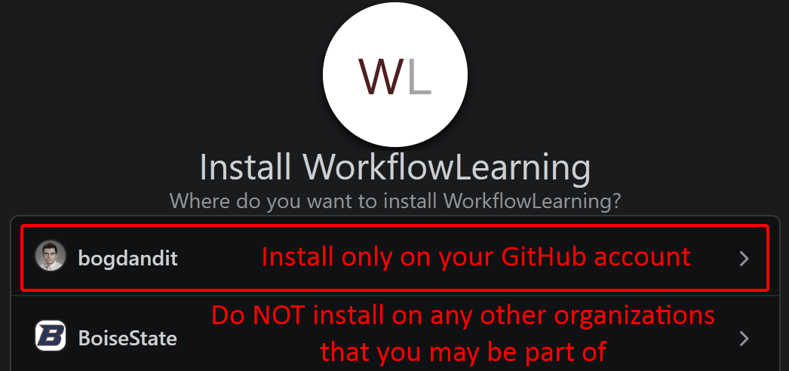

# Workflows and Integration Strategies
This assignment will incentivize you to get familiar with the different GitHub workflow strategies for:
- integrating/merging pull requests and
- establishing traceability between commits, tasks and pull requests

## Step 1 - Create a New Repository
Using your personal GitHub account [create a public, empty GitHub repository](https://github.com/new) called `CS471WorkflowsHomeworkAssignment`.

The following options should be **disabled**/**unchecked**:
- `Add a README file`
- `Add .gitignore`
- `Choose a license`

<details><summary>Why make the repository public?</summary>

:yawning_face: **tl;dr**: it will allow you to visualize the repository history and branches (see [visualization example](https://github.com/BoiseState/CS471-Assignments-Workflows/network)).

Feel free to delete the repository (or make it private) once you complete the assignment.

Creating a public repository will allow you to [visualize your repository history and see all the branches](https://docs.github.com/en/repositories/viewing-activity-and-data-for-your-repository/understanding-connections-between-repositories#viewing-a-repositorys-network), which is a feature that will be extremely useful in this assignment.

However, this [repository insights](https://github.com/pricing#compare-features) feature:
- is not available for personal **private** repositories,
- but it is available for personal **public** repositories (or for personal **private** repositories with a **Team** subscription, which you may not have).

---

</details>


## Step 2 - Clone Starter Code Repository
Clone this [CS471-Assignments-Workflows](https://github.com/BoiseState/CS471-Assignments-Workflows) repository.

```bash
$ git clone https://github.com/BoiseState/CS471-Assignments-Workflows.git

$ cd CS471-Assignments-Workflows
```


## Step 3 - Push the Cloned Code to the New Repository
The contents of `master` branch of the **cloned repository** (from [`Step 2`](#step-2---clone-starter-code-repository)) will be pushed the **repository that you created** (in [`Step 1`](#step-1---create-a-new-repository)).

### Step 3a
Check the existing `origin` remote, which should indicate the URL of the cloned repository:
```bash
$ git remote --verbose
origin  https://github.com/BoiseState/CS471-Assignments-Workflows.git (fetch)
origin  https://github.com/BoiseState/CS471-Assignments-Workflows.git (push)
```

### Step 3b
Remove the `origin` remote pointing to the cloned repository:
```bash
$ git remote remove origin
```

Add a new `origin` remote that will point to the repository that you created (in [`Step 1`](#step-1---create-a-new-repository)):
```bash
$ git remote add origin https://github.com/<GitHubUsername>/CS471WorkflowsHomeworkAssignment.git
or
$ git remote add origin git@github.com:<GitHubUsername>/CS471WorkflowsHomeworkAssignment.git

$ git remote --verbose
origin  https://github.com/<GitHubUsername>/CS471WorkflowsHomeworkAssignment.git (fetch)
origin  https://github.com/<GitHubUsername>/CS471WorkflowsHomeworkAssignment.git (push)
or
origin  git@github.com:<GitHubUsername>/CS471WorkflowsHomeworkAssignment.git (fetch)
origin  git@github.com:<GitHubUsername>/CS471WorkflowsHomeworkAssignment.git (push)
```

### Step 3c
Push the `master` branch to your newly create repository (in [`Step 1`](#step-1---create-a-new-repository)):

```bash
$ git push -u origin master
```

### Step 3d - Push All the Tags
Push **all** tags to your newly create repository (in [`Step 1`](#step-1---create-a-new-repository)):
```bash
$ git push --tags
```


## Step 4 - Create a User Story and Tasks
In your `CS471WorkflowsHomeworkAssignment` repository created in [`Step 1`](#step-1---create-a-new-repository), go to `Issues` -> `New issue` and **create one type of each of the six issues** (i.e., one user story and five tasks), in the ascending order specified.

NOTE: The [GitHub issue templates](https://help.github.com/en/github/building-a-strong-community/configuring-issue-templates-for-your-repository) have already been [configured](.github/ISSUE_TEMPLATE) to create these issues with ease.

At the end of this step, you should have the following issues created:

Issue ID | Issue Type | Title
-------- | ---------- | -----
`#1`     | User Story | Workflow Integrating Strategies
`#2`     | Task       | Merge Integration Strategy
`#3`     | Task       | Rebase Integration Strategy
`#4`     | Task       | Squash with Default Message Integration Strategy
`#5`     | Task       | Squash with Traceability to Task and PR in Commit Message Integration Strategy, but with Some Commits in the Branch Referencing the Task
`#6`     | Task       | Squash with Traceability to Task and PR in Commit Message Integration Strategy, without Any Commits in the Branch Referencing the Task


## Step 5 - Understand the User Story and Tasks
Read and understand the user story `#1`, and the tasks `#2`, `#3`, `#4`, `#5` and `#6` which are all linked to user story `#1`.


## Step 6 - Install the [WorkflowLearning GitHub App](https://github.com/apps/workflowlearning)
Install the [WorkflowLearning GitHub App](https://github.com/apps/workflowlearning):
- **only** on your GitHub account (**NOT** on other organizations that you may be part of) and <details><summary>(click to see a screenshot)</summary>


  ---

</details>

- **only** on your `CS471WorkflowsHomeworkAssignment` repository (**NOT** on all your repositories) <details><summary>(click to see a screenshot)</summary>


  ---

</details>

## Step 7 - Canvas
Answer the questions in the [Canvas](https://boisestatecanvas.instructure.com/) assignment.
